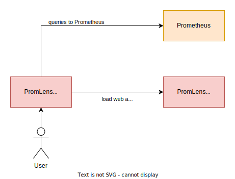

# PromLens

PromLens is a web-based PromQL query builder, analyzer, and visualizer.

## Reporting issues

Please file issues on the [GitHub issue tracker](https://github.com/prometheus/promlens/issues).

## Running PromLens

The following documents how to run PromLens yourself using the [official Docker image](https://hub.docker.com/r/prom/promlens).

### Example deployment

To run PromLens as a preview version without any advanced features (link sharing, Grafana integration):

```
docker run -p 8080:8080 promlabs/promlens
```

To run PromLens with link sharing and Grafana integration enabled, using SQLite for link sharing:

```
docker run -p 8080:8080 promlabs/promlens \
  --shared-links.sql.driver=sqlite3 \
  --shared-links.sql.dsn=/tmp/promlens-links.db \
  --grafana.url=$GRAFANA_URL \
  --grafana.api-token=$GRAFANA_API_TOKEN
```

Then head to http://localhost:8080/ to see the PromLens web UI.

### Flags

The `promlens` binary in the Docker image has the following flags:

```
./promlens --help
usage: promlens [<flags>]

The PromLens server

Flags:
  -h, --help                     Show context-sensitive help (also try --help-long and --help-man).
      --shared-links.gcs.bucket=""
                                 Name of the GCS bucket for storing shared links. Set the GOOGLE_APPLICATION_CREDENTIALS environment variable to point to the JSON file defining your service account credentials (needs to have permission to create, delete, and view objects in the provided bucket).
      --shared-links.sql.driver=""
                                 The SQL driver to use for storing shared links in a SQL database. Supported values: [mysql, sqlite3].
      --shared-links.sql.dsn=""  SQL Data Source Name when using a SQL database to shared links (see https://github.com/go-sql-driver/mysql#dsn-data-source-name) for MySQL, https://github.com/mattn/go-sqlite3#dsn-examples for SQLite3). Alternatively, use the environment variable PROMLENS_SHARED_LINKS_DSN to indicate this value.
      --shared-links.sql.create-tables
                                 Whether to automatically create the required tables when using a SQL database for shared links.
      --shared-links.sql.retention=0
                                 The maximum retention time for shared links when using a SQL database (e.g. '10m', '12h'). Set to 0 for infinite retention.
      --grafana.url=""           The URL of your Grafana installation, to enable the Grafana datasource selector.
      --grafana.api-token=""     The auth token to pass to the Grafana API.
      --grafana.api-token-file=""
                                 A file containing the auth token to pass to the Grafana API.
      --grafana.default-datasource-id=0
                                 The default Grafana datasource ID to use (overrides Grafana's own default).
      --web.listen-address=":8080"
                                 The address to listen on for the web API.
      --web.external-url=""      The URL under which PromLens is externally reachable (for example, if PromLens is served via a reverse proxy). Used for generating relative and absolute links back to PromLens itself. If the URL has a path portion, it will be used to prefix all HTTP endpoints served by PromLens. If omitted, relevant URL components will be derived automatically.
      --web.route-prefix=""      Prefix for the internal routes of web endpoints. Defaults to path of --web.external-url.
      --web.default-prometheus-url=""
                                 The default Prometheus URL to load PromLens with.
      --log.level=info           Only log messages with the given severity or above. One of: [debug, info, warn, error]
      --log.format=logfmt        Output format of log messages. One of: [logfmt, json]
```

For boolean flags that default to `true`, you can set them to `false` by specifying `--no-<flag-name>`, e.g. `--no-shared-links.sql.create-tables`.

### Enabling link sharing

Link sharing allows persisting the state of an entire PromLens query page and sharing it with others.

By default, the link sharing backend is disabled. You can enable link sharing either via Google Cloud Storage, MySQL, or SQLite3:

#### Google Cloud Storage

To use Google Cloud Storage (GCS) for link sharing, set the `--shared-links.gcs.bucket=<bucket name>` flag and set the `GOOGLE_APPLICATION_CREDENTIALS` environment variable to point to a JSON file containing your service account credentials (needs to have permission to create, delete, and view objects in the provided bucket).

#### SQlite3

To save shared links to a local SQLite3 database, set the `--shared-links.sql.driver=sqlite3` and `--shared-links.sql.dsn=<database filename>` flags.

#### MySQL

To save shared links in a MySQL database, set the `--shared-links.sql.driver=mysql` and `--shared-links.sql.dsn=<data source name>` flag (see https://github.com/go-sql-driver/mysql#dsn-data-source-name for MySQL DNS specifications).

By default, PromLens will try to auto-create the necessary tables in your MySQL database. This requires the PromLens database user to have `CREATE` permissions. To turn off automatic table creation for MySQL, set the `--no-shared-links.sql.create-tables` flag. If you want to create tables manually, run the following against your PromLens MySQL database:

```sql
CREATE TABLE IF NOT EXISTS link (
  id INT AUTO_INCREMENT PRIMARY KEY,
  created_at TIMESTAMP DEFAULT CURRENT_TIMESTAMP,
  short_name VARCHAR(11) UNIQUE,
  page_state TEXT
);

CREATE TABLE IF NOT EXISTS view(
  id INT AUTO_INCREMENT PRIMARY KEY,
  link_id INTEGER,
  viewed_at TIMESTAMP DEFAULT CURRENT_TIMESTAMP,
  FOREIGN KEY(link_id) REFERENCES link(id)
);
```

### Enabling Grafana datasource integration

To enable selection of datasources from an existing Grafana installation, set the `--grafana.url` flag to the URL of your Grafana installation, as well as either the `--grafana.api-token` flag (providing an API token directly as a flag) or the `--grafana.api-token-file` flag (providing an API token from a file).

#### Creating a Grafana API token

To create an API token suitable for looking up datasources in Grafana:

- Head to "Configuration > API Keys" in Grafana.
- Click "Add API key".
- Give the key a descriptive name, set the "Role" to "Admin", and set its life time to the desired duration (long is recommended, as you will need to regenerate it frequently otherwise).
- Press "Add" and note down the displayed API key.

### Direct links to queries

You can link to a specific query without creating a persisted shared link by appending a `q` query parameter to the PromLens URL. For example, https://promlens.com/?q=up directly displays and executes the query `up`. For more complex shared pages, we still recommend creating a full shared page link, as this allows more control over the tree view state, as well as the selected visualization methods.

### Architecture

Depending on whether you use advanced features, the PromLens backend has fewer or more responsibilities:

#### Basic features

When running the PromLens without any link sharing or Grafana integration, the backend is only used to serve static assets and parse PromQL queries into a tree view:



#### Advanced features

If you enable link sharing and/or Grafana datasource integration, the backend also stores and retrieves shared links and connects to Grafana to list datasources and proxy queries:


